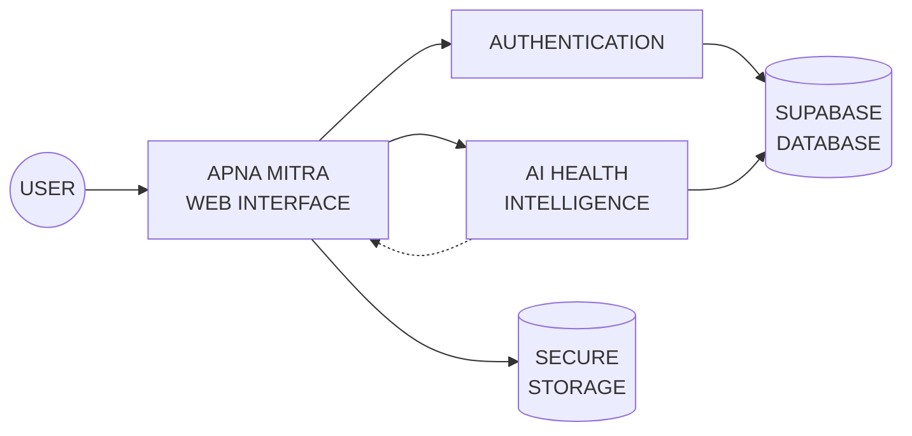

<div align="center">

<br>


<br>


<br><br>

<a href="https://apna-mitra-ai-healtth.ai.studio/">

</a>

 

<a href="#-architecture">

</a>

<br><br>


<br><br>

</div>

---

<div align="center">

# `01 / SYSTEM INITIALIZATION`

</div>

```text
╭──────────────────────────────────────────────────────────────────────────────╮
│                                                                              │
│   $ ./initialize-apna-mitra.sh                                              │
│                                                                              │
│   [■■■■■■■■■■■■■■■■■■■■■■■■■■■■■■■■■■■■] 100%                            │
│                                                                              │
│   ✓ Loading healthcare intelligence...                                      │
│   ✓ Initializing AI services...                                             │
│   ✓ Establishing secure database connection...                              │
│   ✓ Loading authentication layer...                                         │
│   ✓ Starting health-analysis engine...                                      │
│   ✓ Optimizing user experience...                                           │
│                                                                              │
│   SYSTEM STATUS :  ● ONLINE                                                 │
│                                                                              │
│   > Welcome to APNA MITRA                                                    │
│   > Technology that cares. Intelligence that helps.                         │
│                                                                              │
╰──────────────────────────────────────────────────────────────────────────────╯
```

<br>

<div align="center">

> **Apna Mitra** is an AI-powered healthcare platform engineered to make
> healthcare assistance **smarter, simpler and more accessible.**

<br>


</div>

---

<div align="center">

# `02 / LIVE SYSTEM`

### 🌐 Experience the Application

<a href="https://apna-mitra-ai-healtth.ai.studio/">


</a>

<br><br>

```text
┌────────────────────────────────────────────────────────────────────┐
│                                                                    │
│   APNA MITRA                                                       │
│   ─────────────────────────────────────────────────────────────    │
│                                                                    │
│   AI HEALTHCARE ENGINE                                            │
│                                                                    │
│   [ USER ]                                                        │
│      │                                                             │
│      ▼                                                             │
│   [ AUTHENTICATION ]                                              │
│      │                                                             │
│      ▼                                                             │
│   [ AI PROCESSING ]                                               │
│      │                                                             │
│      ├──────────────► Health Analysis                              │
│      │                                                             │
│      ├──────────────► Intelligent Assistance                       │
│      │                                                             │
│      └──────────────► Personalized Insights                        │
│                                                                    │
│      ▼                                                             │
│   [ SECURE DATABASE ]                                             │
│                                                                    │
└────────────────────────────────────────────────────────────────────┘
```

</div>

---

<div align="center">

# `03 / ARCHITECTURE`

</div>



---

<div align="center">

# `04 / CORE MODULES`

</div>

<table align="center">
<tr>
<td align="center" width="25%">

### 🧠

**AI ENGINE**

Intelligent healthcare assistance and analysis.

</td>

<td align="center" width="25%">

### 🩺

**HEALTH CHECKER**

Interactive health-focused analysis and guidance.

</td>

<td align="center" width="25%">

### 🔐

**SECURITY**

Authentication and protected user data.

</td>

<td align="center" width="25%">

### ☁️

**CLOUD DATA**

Supabase-powered backend infrastructure.

</td>
</tr>
</table>

---

<div align="center">

# `05 / DEVELOPER TERMINAL`

</div>

```console
aditya@apna-mitra:~$ systemctl status apna-mitra

● apna-mitra.service - AI Healthcare Platform
   Loaded: loaded
   Active: active (running)

   ├── AI Engine ................. RUNNING
   ├── Health Checker ............ RUNNING
   ├── Authentication ............ SECURE
   ├── Supabase .................. CONNECTED
   ├── Storage ................... READY
   └── Web Interface ............. ONLINE

aditya@apna-mitra:~$ health --status

AI_CORE       ████████████████████ 100%
DATABASE      ████████████████████ 100%
SECURITY      ████████████████████ 100%
INTERFACE     ████████████████████ 100%

> ALL SYSTEMS OPERATIONAL ✓
```

---

<div align="center">

# `06 / THE VISION`

<br>


<br><br>

### `BUILDING TECHNOLOGY FOR A HUMAN PURPOSE.`

<br>


<br>

<sub>

`CREATED ❤️ BY ADITYA KUMAR`

</sub>

</div>
